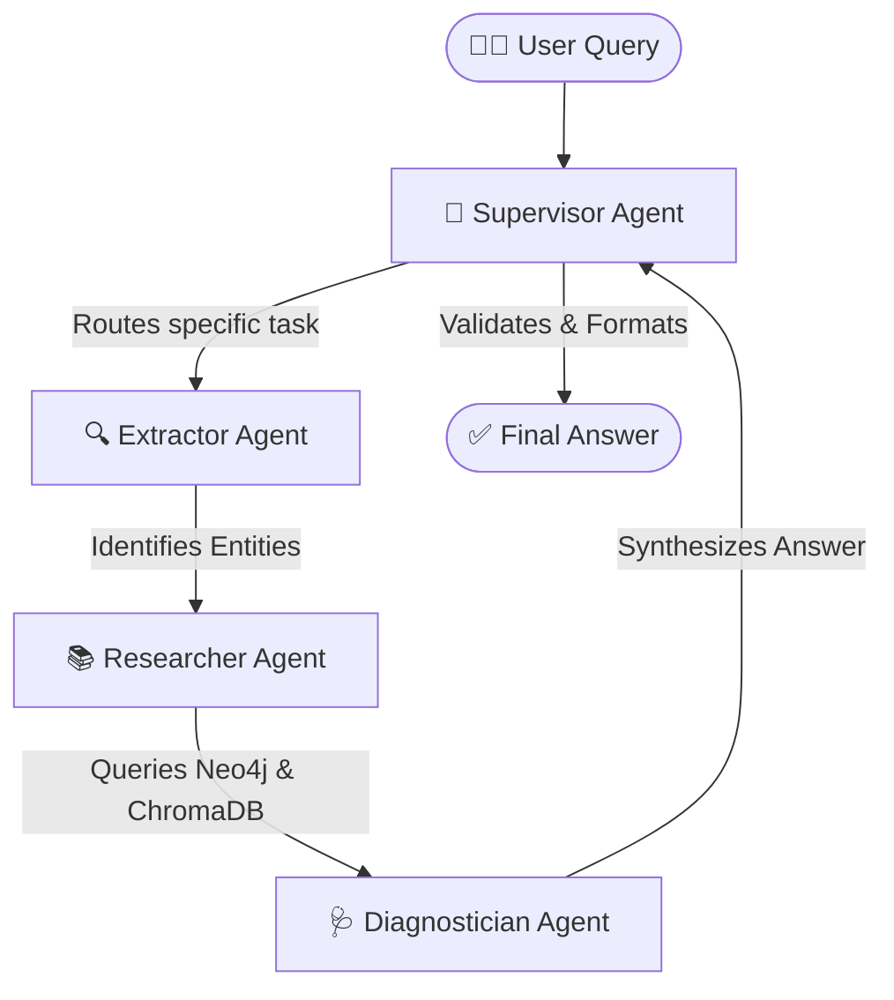

# 🍇 Grape-Mind AI — Advanced Hybrid Graph RAG & Multi-Agent Chatbot

<div align="center">


**A state-of-the-art Multi-Agent system for viticulture. Features a Hybrid Graph/Vector RAG pipeline governed by a LangGraph Supervisor, with dual support for Cloud APIs (Gemini) and Locally Fine-Tuned Open-Source Models (Llama-3 8B).**

</div>

---

## 🚀 Key Architectural Upgrades (V2.0)

This project has evolved beyond standard RAG into a highly advanced enterprise-grade AI architecture:

- 🧠 **Multi-Agent Orchestration (LangGraph):** The system no longer relies on a single LLM prompt. Queries are routed by a `Supervisor Agent` to specialized sub-agents (`Extractor`, `Researcher`, `Diagnostician`), mimicking human diagnostic workflows.
- 🔬 **Custom Model Fine-Tuning (QLoRA):** Developed a custom pipeline to automatically extract Ground Truth data from the Neo4j Graph to generate instruction-tuning JSONL datasets. Successfully fine-tuned **Meta Llama-3-8B** using 4-bit Quantization, LoRA adapters, and HuggingFace `TRL`.
- 🔍 **Hybrid Retrieval:** Context is pulled both deterministically from structured knowledge (**Neo4j**) and semantically from unstructured PDF manuals (**ChromaDB**).
- 🌐 **Cloud vs. Local Execution:** The live Streamlit app runs securely on Gemini for serverless efficiency, while the architecture natively supports plugging in the locally fine-tuned Llama-3 weights for offline inference.

---

## 🏗️ Multi-Agent Architecture



---

## 🗂️ Project Structure

```
agrichatbot/
├── app.py                  # 🚀 Main Streamlit application (UI + LangGraph Execution)
├── agents/
│   └── workflow.py         # 🧠 LangGraph StateGraph, Nodes, and Agent definitions
├── dataset_prep.py         # 🗄️ Automated script to extract Neo4j Graph into JSONL
├── fine_tune.py            # 🔬 PyTorch/HuggingFace script for Llama-3 QLoRA fine-tuning
├── ingest_data.py          # 📥 PDF ingestion → chunking → ChromaDB storage
├── populate_graph.py       # 🌱 Seeds Neo4j with grape variety/disease/treatment data
├── requirements.txt        # 📦 Python dependencies
├── .env                    # 🔑 API keys and DB credentials (not committed)
├── chroma_db/              # 🗄️ Persistent local ChromaDB vector store
└── data/                   # 📂 Place your agricultural PDF manuals here
```

---

## 🔬 Local Fine-Tuning (Llama-3 8B)

This project includes a fully functional pipeline to train an offline, open-source model using the exact facts from the Neo4j Database.

1. **Dataset Generation:** Run `python dataset_prep.py` to recursively crawl the Neo4j Graph (`Variety -> Disease -> Treatment`) and output 100+ high-quality Question/Answer pairs into `agri_dataset.jsonl`.
2. **Model Training:** Upload `fine_tune.py` and the dataset to Google Colab (T4 GPU). The script uses **BitsAndBytes (4-bit)** and **PEFT (LoRA)** to train `NousResearch/Meta-Llama-3-8B` without running out of memory.
3. **Local Inference:** The resulting adapter weights (`adapter_model.safetensors`) can be downloaded and run locally on a 4GB VRAM GPU (e.g., RTX 3050) using CPU offloading configuration.

---

## ⚙️ Setup & Installation

### Prerequisites
- Python 3.10+
- A [Neo4j AuraDB](https://neo4j.com/cloud/platform/aura-graph-database/) account (free tier works)
- A [Google AI Studio](https://aistudio.google.com/) API key (Gemini)

### 1. Clone the Repository
```bash
git clone https://github.com/YOUR_USERNAME/agrichatbot.git
cd agrichatbot
```

### 2. Create a Virtual Environment
```bash
python -m venv venv

# Windows
venv\Scripts\activate

# macOS/Linux
source venv/bin/activate
```

### 3. Install Dependencies
```bash
pip install -r requirements.txt
```

*(Note: PyTorch, Transformers, and Accelerate are deliberately excluded from the core Streamlit `requirements.txt` to keep the cloud deployment lightweight. They are only required for the local `fine_tune.py` pipeline).*

### 4. Configure Environment Variables

Create a `.env` file in the root directory:

```env
GOOGLE_API_KEY=your_google_gemini_api_key
NEO4J_URI=neo4j+ssc://your-instance.databases.neo4j.io
NEO4J_USERNAME=neo4j
NEO4J_PASSWORD=your_neo4j_password
```

### 5. Launch the Streamlit App
```bash
streamlit run app.py
```

---

## 🌍 Live Features

- **💬 LangGraph Workflows** — Watch the sidebar to see exactly which Agent is currently "thinking".
- **🕸️ Graph Visualizer** — See the live Neo4j knowledge graph rendered interactively.
- **🌐 Multi-Language** — Agents synthesize final responses in English, Hindi, Marathi, Kannada, or Telugu.
- **📱 Mobile Responsive** — The UI was built with `use_container_width=True` to support offline fieldwork on mobile phones.

---

<div align="center">

Made with ❤️ for Indian Grape Farmers | Engineered for Advanced AI Portfolios

</div>
